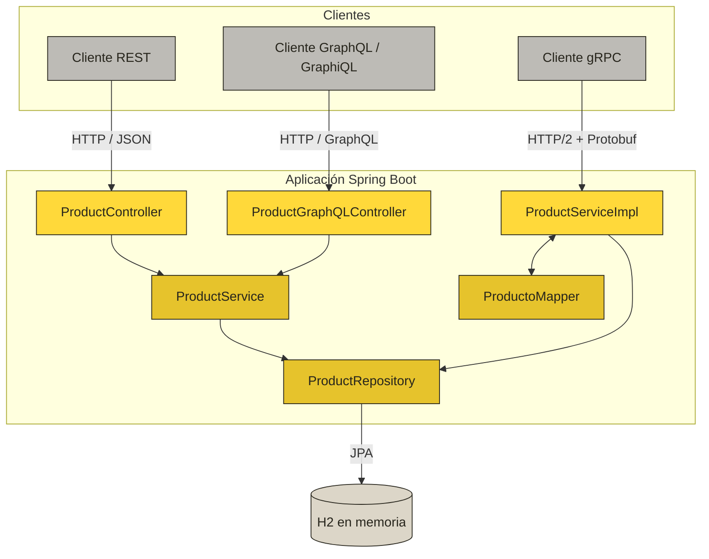
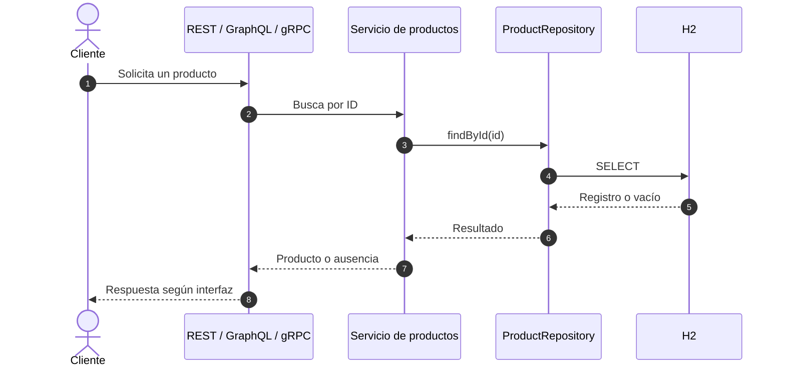

# ArqWeb — API REST, GraphQL y gRPC de productos


[](https://github.com/RyukGore/arqWebUnidadII/commits/main)
[](https://github.com/RyukGore/arqWebUnidadII)
[](https://github.com/RyukGore/arqWebUnidadII/graphs/commit-activity)

Aplicación académica desarrollada con Spring Boot para administrar un catálogo de productos. El proyecto expone la misma persistencia mediante tres interfaces: una API REST, una API GraphQL y un servicio gRPC. La información se almacena con Spring Data JPA en una base de datos H2 en memoria.

## Navegación rápida

| Documentación | APIs | Proyecto |
| --- | --- | --- |
| [Características](#características) | [REST](#api-rest) | [Instalación](#instalación-y-ejecución) |
| [Arquitectura](#arquitectura) | [GraphQL](#api-graphql) | [Pruebas](#pruebas) |
| [Modelo de producto](#modelo-de-producto) | [gRPC](#servicio-grpc) | [Estructura](#estructura-del-proyecto) |
| [Tecnologías](#tecnologías) | [Consola H2](#consola-h2) | [Configuración](#configuración-actual) |

> [!TIP]
> Los bloques con el texto **“Ver ejemplo”** son desplegables. Los badges superiores se actualizan automáticamente con la actividad del repositorio.

## Características

- CRUD de productos mediante REST.
- Consultas y mutaciones mediante GraphQL.
- Operaciones CRUD mediante llamadas unarias gRPC.
- Interfaz GraphiQL para explorar la API GraphQL.
- Consola web de H2 para consultar la base de datos durante la ejecución.
- Generación automática de clases Java desde Protocol Buffers durante la compilación.
- Maven Wrapper incluido; no es necesario instalar Maven globalmente.

## Arquitectura



<details>
<summary><strong>Ver flujo de una operación de consulta</strong></summary>



</details>

| Componente | Responsabilidad |
| --- | --- |
| `ProductController` | Expone los endpoints REST. |
| `ProductGraphQLController` | Expone las consultas y mutaciones GraphQL. |
| `ProductService` | Centraliza la lógica usada por REST y GraphQL. |
| `ProductServiceImpl` | Implementa el servicio gRPC generado desde `producto.proto`. |
| `ProductoMapper` | Convierte entre la entidad JPA y los mensajes Protocol Buffers. |
| `ProductRepository` | Gestiona la persistencia mediante Spring Data JPA. |
| `Product` | Representa la entidad almacenada en la tabla `productos`. |

## Tecnologías

| Tecnología | Versión | Uso |
| --- | --- | --- |
| Java | 21 | Lenguaje y plataforma de ejecución. |
| Spring Boot | 4.1.0 | Configuración y ejecución de la aplicación. |
| Spring Web MVC | Administrada por Spring Boot | API REST. |
| Spring for GraphQL | Administrada por Spring Boot | API GraphQL y GraphiQL. |
| Spring Data JPA | Administrada por Spring Boot | Persistencia de datos. |
| H2 Database | Administrada por Spring Boot | Base de datos en memoria. |
| gRPC Java | 1.72.0 | Contrato y comunicación RPC. |
| grpc-server-spring-boot-starter | 3.1.0.RELEASE | Integración del servidor gRPC con Spring Boot. |
| Protocol Buffers | 4.30.2 | Generación de mensajes y servicios Java. |
| Lombok | Administrada por Spring Boot | Generación de constructores y métodos de acceso. |
| Maven Wrapper | Incluido | Compilación y ejecución reproducibles. |

## Requisitos

- JDK 21 o superior.
- Git para clonar el repositorio.
- Opcional: `grpcurl` para probar el servicio gRPC desde la terminal.

Verifica la versión instalada:

```bash
java -version
javac -version
```

## Instalación y ejecución

1. Clona el repositorio:

   ```bash
   git clone https://github.com/RyukGore/arqWebUnidadII.git
   cd arqWebUnidadII
   ```

2. Compila el proyecto. Este paso también genera las clases Java definidas en `src/main/proto/producto.proto`:

   **Linux/macOS**

   ```bash
   ./mvnw clean compile
   ```

   **Windows PowerShell**

   ```powershell
   .\mvnw.cmd clean compile
   ```

3. Inicia la aplicación:

   **Linux/macOS**

   ```bash
   ./mvnw spring-boot:run
   ```

   **Windows PowerShell**

   ```powershell
   .\mvnw.cmd spring-boot:run
   ```

La API HTTP se inicia en el puerto `5400`. Como el proyecto no sobrescribe la configuración de gRPC, el servidor gRPC usa el puerto predeterminado `9090` del starter.

## Modelo de producto

La entidad persistida y las interfaces REST y gRPC manejan los siguientes datos:

```json
{
  "id": "PROD-001",
  "nombre": "Monitor 24 pulgadas",
  "descripcion": "Monitor IPS Full HD",
  "precio": 799900.0,
  "cantidad": 10
}
```

| Campo | Java | REST | GraphQL | Protocol Buffers | Descripción |
| --- | --- | --- | --- | --- | --- |
| `id` | `String` | Cadena | `ID!` | `string` | Identificador único y llave primaria. |
| `nombre` | `String` | Cadena | `String` | `string` | Nombre del producto. |
| `descripcion` | `String` | Cadena | `String` | `string` | Descripción del producto. |
| `precio` | `double` | Número | `Float` | `double` | Precio del producto. |
| `cantidad` | `int` | Entero | No expuesto | `int32` | Unidades disponibles. |

> El esquema GraphQL actual no declara `cantidad`; por eso este campo solo está disponible mediante REST y gRPC.

## API REST

Base URL: `http://localhost:5400/api/v1/products`

| Método | Ruta | Descripción | Respuesta |
| --- | --- | --- | --- |
| `GET` | `/api/v1/products` | Lista todos los productos. | `200 OK` |
| `GET` | `/api/v1/products/{id}` | Busca un producto por ID. | `200 OK` o `404 Not Found` |
| `POST` | `/api/v1/products` | Crea o guarda un producto. | `200 OK` |
| `PUT` | `/api/v1/products` | Actualiza el producto indicado en el cuerpo. | `200 OK` o `404 Not Found` |
| `DELETE` | `/api/v1/products/{id}` | Elimina un producto y devuelve el registro eliminado. | `200 OK` o `404 Not Found` |

### Ejemplos REST

<details>
<summary><strong>Ver ejemplo: crear un producto</strong></summary>

```bash
curl --request POST 'http://localhost:5400/api/v1/products' \
  --header 'Content-Type: application/json' \
  --data '{
    "id": "PROD-001",
    "nombre": "Monitor 24 pulgadas",
    "descripcion": "Monitor IPS Full HD",
    "precio": 799900.0,
    "cantidad": 10
  }'
```

</details>

<details>
<summary><strong>Ver ejemplo: actualizar un producto</strong></summary>

```bash
curl --request PUT 'http://localhost:5400/api/v1/products' \
  --header 'Content-Type: application/json' \
  --data '{
    "id": "PROD-001",
    "nombre": "Monitor 24 pulgadas actualizado",
    "descripcion": "Monitor IPS Full HD con configuración actualizada",
    "precio": 849900.0,
    "cantidad": 8
  }'
```

</details>

<details>
<summary><strong>Ver ejemplo: consultar y eliminar productos</strong></summary>

```bash
curl 'http://localhost:5400/api/v1/products'
curl 'http://localhost:5400/api/v1/products/PROD-001'
curl --request DELETE 'http://localhost:5400/api/v1/products/PROD-001'
```

</details>

## API GraphQL

| Recurso | URL |
| --- | --- |
| Endpoint GraphQL | `http://localhost:5400/graphql` |
| Interfaz GraphiQL | `http://localhost:5400/graphiql` |
| Esquema | `src/main/resources/graphql/schema.graphqls` |

### Ejemplos GraphQL

<details>
<summary><strong>Ver ejemplo: consultar productos</strong></summary>

```graphql
query ListarProductos {
  products {
    id
    nombre
    descripcion
    precio
  }
}
```

</details>

<details>
<summary><strong>Ver ejemplo: consultar un producto por ID</strong></summary>

```graphql
query ObtenerProducto {
  productById(id: "PROD-001") {
    id
    nombre
    descripcion
    precio
  }
}
```

</details>

<details>
<summary><strong>Ver ejemplo: crear un producto</strong></summary>

```graphql
mutation CrearProducto {
  createProduct(input: {
    id: "PROD-001"
    nombre: "Monitor 24 pulgadas"
    descripcion: "Monitor IPS Full HD"
    precio: 799900.0
  }) {
    id
    nombre
    precio
  }
}
```

</details>

<details>
<summary><strong>Ver ejemplo: actualizar un producto</strong></summary>

```graphql
mutation ActualizarProducto {
  updateProduct(input: {
    id: "PROD-001"
    nombre: "Monitor 24 pulgadas actualizado"
    descripcion: "Monitor IPS Full HD con configuración actualizada"
    precio: 849900.0
  }) {
    id
    nombre
    descripcion
    precio
  }
}
```

</details>

<details>
<summary><strong>Ver ejemplo: eliminar un producto</strong></summary>

```graphql
mutation EliminarProducto {
  deleteProduct(id: "PROD-001") {
    id
    nombre
  }
}
```

</details>

## Servicio gRPC

El contrato está definido en `src/main/proto/producto.proto` y declara el servicio `productos.ProductoService`.

| RPC | Solicitud | Respuesta | Descripción |
| --- | --- | --- | --- |
| `CrearProducto` | `Producto` | `Producto` | Crea y devuelve un producto. |
| `ObtenerProducto` | `ProductoId` | `Producto` | Busca un producto por ID. |
| `ListarProductos` | `google.protobuf.Empty` | `Productos` | Lista todos los productos. |
| `ActualizarProducto` | `Producto` | `Producto` | Actualiza un producto existente. |
| `EliminarProducto` | `ProductoId` | `Producto` | Elimina y devuelve un producto. |

### Ejemplos con grpcurl

Los comandos usan el archivo `.proto` local.

<details>
<summary><strong>Ver ejemplo: listar productos</strong></summary>

```bash
grpcurl -plaintext \
  -import-path src/main/proto \
  -proto producto.proto \
  localhost:9090 productos.ProductoService/ListarProductos
```

</details>

<details>
<summary><strong>Ver ejemplo: crear un producto</strong></summary>

```bash
grpcurl -plaintext \
  -import-path src/main/proto \
  -proto producto.proto \
  -d '{"id":"PROD-002","nombre":"Teclado","descripcion":"Teclado mecánico","precio":249900,"cantidad":15}' \
  localhost:9090 productos.ProductoService/CrearProducto
```

</details>

> Actualmente, cuando gRPC no encuentra un producto al consultar, actualizar o eliminar, la implementación devuelve un mensaje `Producto` vacío en lugar de un estado `NOT_FOUND`.

## Consola H2

Con la aplicación en ejecución, abre `http://localhost:5400/h2-console` y utiliza:

| Parámetro | Valor |
| --- | --- |
| JDBC URL | `jdbc:h2:mem:polidb` |
| User Name | `sa` |
| Password | Vacío |

H2 está configurada en memoria; los datos se eliminan cuando la aplicación se detiene.

## Pruebas

**Linux/macOS**

```bash
./mvnw test
```

**Windows PowerShell**

```powershell
.\mvnw.cmd test
```

La suite actual contiene una prueba de carga del contexto de Spring Boot.

## Estructura del proyecto

```text
src/
├── main/
│   ├── java/poli/edu/arqweb/arqweb/
│   │   ├── controller/
│   │   │   ├── ProductController.java
│   │   │   └── ProductGraphQLController.java
│   │   ├── mapper/ProductoMapper.java
│   │   ├── model/Product.java
│   │   ├── repository/ProductRepository.java
│   │   ├── service/
│   │   │   ├── ProductService.java
│   │   │   └── ProductServiceImpl.java
│   │   └── ArqWebApplication.java
│   ├── proto/producto.proto
│   └── resources/
│       ├── graphql/schema.graphqls
│       └── application.yaml
└── test/
    └── java/poli/edu/arqweb/arqweb/ArqWebApplicationTests.java
```

## Configuración actual

| Configuración | Valor |
| --- | --- |
| Aplicación | `ArqWeb` |
| Puerto HTTP | `5400` |
| Puerto gRPC | `9090` predeterminado |
| Base de datos | `jdbc:h2:mem:polidb` |
| Consola H2 | `/h2-console` |
| Endpoint GraphQL | `/graphql` |
| Interfaz GraphiQL | `/graphiql` |

## Consideraciones del proyecto

- REST y GraphQL comparten `ProductService`; gRPC accede directamente a `ProductRepository` mediante `ProductServiceImpl`.
- `POST /api/v1/products` utiliza `save`, por lo que un ID existente puede sobrescribir el registro en lugar de producir un conflicto.
- No hay validaciones de entrada ni manejo global de excepciones configurados actualmente.
- La persistencia es volátil porque H2 se ejecuta en memoria.

## Autor

Juan Sebastian Wilches
Alirio Rodriguez
Desarrollado como parte de la Unidad 3 de Arquitectura de Aplicaciones Web.
