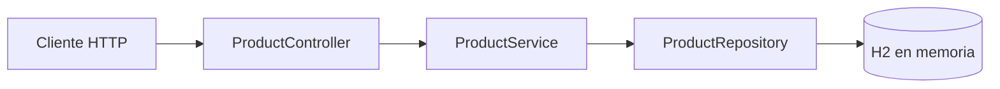

# ArqWeb — API REST de productos


API REST académica para administrar un catálogo de productos. El proyecto implementa operaciones CRUD y una arquitectura por capas utilizando Spring Boot, Spring MVC, Spring Data JPA y una base de datos H2 en memoria.

## Características

- Consulta de todos los productos.
- Consulta de un producto por su identificador.
- Creación, actualización y eliminación de productos.
- Persistencia mediante JPA.
- Consola web de H2 habilitada para desarrollo.
- Maven Wrapper incluido; no es necesario instalar Maven globalmente.

## Arquitectura



| Capa | Responsabilidad |
|---|---|
| Controller | Expone los endpoints HTTP y construye las respuestas. |
| Service | Contiene la lógica de aplicación para gestionar productos. |
| Repository | Proporciona las operaciones de persistencia con Spring Data JPA. |
| Model | Representa la entidad `Product` y su tabla `productos`. |

## Tecnologías

| Tecnología | Uso |
|---|---|
| Java 21 | Lenguaje y plataforma de ejecución. |
| Spring Boot 4.1.0 | Configuración y ejecución de la aplicación. |
| Spring MVC | Exposición de la API REST. |
| Spring Data JPA | Acceso y persistencia de datos. |
| H2 Database | Base de datos en memoria para desarrollo. |
| Lombok | Generación de constructores y métodos de acceso. |
| Maven Wrapper | Gestión reproducible de dependencias y construcción. |

## Requisitos

- JDK 21 o superior.
- Git.

> El repositorio incluye Maven Wrapper (`mvnw` y `mvnw.cmd`), por lo que Maven no es un requisito adicional.

## Instalación y ejecución

1. Clona el repositorio:

   ```bash
   git clone https://github.com/RyukGore/arqWebUnidadII.git
   cd arqWebUnidadII
   ```

2. Inicia la aplicación:

   **Linux/macOS**

   ```bash
   ./mvnw spring-boot:run
   ```

   **Windows**

   ```powershell
   .\mvnw.cmd spring-boot:run
   ```

3. La API quedará disponible en:

   ```text
   http://localhost:5400/api/v1/products
   ```

## Modelo de producto

```json
{
  "id": "PROD-001",
  "nombre": "Monitor 24 pulgadas",
  "descripcion": "Monitor IPS Full HD",
  "precio": 799900.00
}
```

| Campo | Tipo | Descripción |
|---|---|---|
| `id` | String | Identificador único y llave primaria. |
| `nombre` | String | Nombre del producto. |
| `descripcion` | String | Descripción general del producto. |
| `precio` | BigDecimal | Precio del producto. |

## Endpoints

Base URL: `http://localhost:5400/api/v1/products`

| Método | Ruta | Descripción | Respuesta esperada |
|---|---|---|---|
| `GET` | `/api/v1/products` | Lista todos los productos. | `200 OK` |
| `GET` | `/api/v1/products/{id}` | Consulta un producto por ID. | `200 OK` o `404 Not Found` |
| `POST` | `/api/v1/products` | Crea o persiste un producto. | `200 OK` |
| `PUT` | `/api/v1/products` | Actualiza usando el ID del cuerpo. | `200 OK` o `404 Not Found` |
| `DELETE` | `/api/v1/products/{id}` | Elimina un producto por ID. | `200 OK` o `404 Not Found` |

### Crear un producto

```bash
curl --request POST 'http://localhost:5400/api/v1/products' \
  --header 'Content-Type: application/json' \
  --data '{
    "id": "PROD-001",
    "nombre": "Monitor 24 pulgadas",
    "descripcion": "Monitor IPS Full HD",
    "precio": 799900.00
  }'
```

### Consultar productos

```bash
curl 'http://localhost:5400/api/v1/products'
curl 'http://localhost:5400/api/v1/products/PROD-001'
```

### Actualizar un producto

```bash
curl --request PUT 'http://localhost:5400/api/v1/products' \
  --header 'Content-Type: application/json' \
  --data '{
    "id": "PROD-001",
    "nombre": "Monitor 24 pulgadas",
    "descripcion": "Monitor IPS Full HD actualizado",
    "precio": 849900.00
  }'
```

### Eliminar un producto

```bash
curl --request DELETE 'http://localhost:5400/api/v1/products/PROD-001'
```

## Consola H2

Con la aplicación en ejecución, abre `http://localhost:5400/h2-console` e ingresa:

| Parámetro | Valor |
|---|---|
| JDBC URL | `jdbc:h2:mem:polidb` |
| User Name | `sa` |
| Password | Vacío |

> H2 está configurada en memoria. Los datos se eliminan cada vez que se detiene la aplicación.

## Pruebas

```bash
./mvnw test
```

En Windows:

```powershell
.\mvnw.cmd test
```

## Estructura del proyecto

```text
src/
├── main/
│   ├── java/poli/edu/arqweb/arqweb/
│   │   ├── controller/ProductController.java
│   │   ├── model/Product.java
│   │   ├── repository/ProductRepository.java
│   │   ├── service/ProductService.java
│   │   └── ArqWebApplication.java
│   └── resources/application.yaml
└── test/
    └── java/poli/edu/arqweb/arqweb/ArqWebApplicationTests.java
```

## Configuración actual

- Aplicación: `ArqWeb`.
- Puerto HTTP: `5400`.
- Base de datos: H2 en memoria.
- Nombre de la base de datos: `polidb`.
- Consola H2: `/h2-console`.

## Consideraciones para producción

Este proyecto está orientado a aprendizaje y desarrollo local. Para evolucionarlo hacia producción se recomienda incorporar:

- Validación de entrada con Jakarta Validation.
- Manejo global y estandarizado de excepciones.
- Autenticación y autorización con Spring Security.
- Base de datos persistente y migraciones versionadas.
- Pruebas unitarias, de integración y de API más completas.
- Documentación OpenAPI/Swagger.
- Contenedorización y configuración mediante variables de entorno.

## Autor

Desarrollado como parte de la Unidad II de Arquitectura Web.
