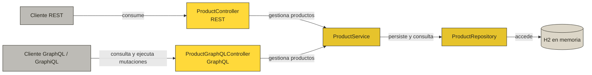

# ArqWeb — API REST y GraphQL de productos


Aplicación académica de Spring Boot para administrar un catálogo de productos. Expone dos interfaces sobre la misma lógica de negocio y persistencia: una API REST y una API GraphQL. La solución usa Spring Data JPA y una base de datos H2 en memoria.

## Características

- CRUD REST de productos.
- Consultas GraphQL para consultar todos los productos o uno por identificador.
- Mutaciones GraphQL para crear, actualizar y eliminar productos.
- Interfaz GraphiQL para explorar y probar la API GraphQL.
- Persistencia con Spring Data JPA y H2.
- Maven Wrapper incluido; no se requiere instalar Maven globalmente.

## Arquitectura



| Capa | Responsabilidad |
| --- | --- |
| `ProductController` | Expone los endpoints REST. |
| `ProductGraphQLController` | Expone las consultas y mutaciones GraphQL. |
| `ProductService` | Centraliza la lógica de gestión de productos. |
| `ProductRepository` | Proporciona persistencia mediante Spring Data JPA. |
| `Product` | Representa la entidad y la tabla `productos`. |

## Tecnologías

| Tecnología | Uso |
| --- | --- |
| Java 21 | Lenguaje y plataforma de ejecución. |
| Spring Boot 4.1.0 | Configuración y ejecución de la aplicación. |
| Spring Web MVC | Exposición de la API REST. |
| Spring for GraphQL | Implementación de la API GraphQL. |
| Spring Data JPA | Acceso y persistencia de datos. |
| H2 Database | Base de datos en memoria para desarrollo. |
| Lombok | Generación de constructores y métodos de acceso. |
| Maven Wrapper | Gestión reproducible de dependencias y construcción. |

## Requisitos

- JDK 21 o superior.
- Git, si se clona el repositorio.

> Verifica que `java -version` y `javac -version` indiquen Java 21. El proyecto no compila correctamente con un JRE o JDK 8.

## Instalación y ejecución

1. Clona el repositorio:

   ```bash
   git clone https://github.com/RyukGore/arqWebUnidadII.git
   cd arqWebUnidadII
   ```

2. Compila e inicia la aplicación.

   **Linux/macOS**

   ```bash
   ./mvnw clean compile
   ./mvnw spring-boot:run
   ```

   **Windows PowerShell**

   ```powershell
   .\mvnw.cmd clean compile
   .\mvnw.cmd spring-boot:run
   ```

3. Una vez iniciada, la aplicación usa el puerto `5400`.

## Modelo de producto

```json
{
  "id": "PROD-001",
  "nombre": "Monitor 24 pulgadas",
  "descripcion": "Monitor IPS Full HD",
  "precio": 799900.00
}
```

| Campo | Tipo Java | Tipo GraphQL | Descripción |
| --- | --- | --- | --- |
| `id` | `String` | `ID!` | Identificador único y llave primaria. |
| `nombre` | `String` | `String` | Nombre del producto. |
| `descripcion` | `String` | `String` | Descripción general del producto. |
| `precio` | `BigDecimal` | `Float` | Precio del producto. |

## API REST

Base URL: `http://localhost:5400/api/v1/products`

| Método | Ruta | Descripción | Respuesta esperada |
| --- | --- | --- | --- |
| `GET` | `/api/v1/products` | Lista todos los productos. | `200 OK` |
| `GET` | `/api/v1/products/{id}` | Consulta un producto por ID. | `200 OK` o `404 Not Found` |
| `POST` | `/api/v1/products` | Crea un producto. | `200 OK` |
| `PUT` | `/api/v1/products` | Actualiza un producto usando el ID del cuerpo. | `200 OK` o `404 Not Found` |
| `DELETE` | `/api/v1/products/{id}` | Elimina un producto por ID. | `200 OK` o `404 Not Found` |

### Crear o actualizar un producto

```bash
curl --request POST 'http://localhost:5400/api/v1/products' \
  --header 'Content-Type: application/json' \
  --data '{
    "id": "PROD-001",
    "nombre": "Monitor 24 pulgadas",
    "descripcion": "Monitor IPS Full HD",
    "precio": 799900.00
  }'
```

Para actualizar, usa el mismo cuerpo con `PUT` sobre `http://localhost:5400/api/v1/products`.

## API GraphQL

| Recurso | URL |
| --- | --- |
| Endpoint GraphQL | `http://localhost:5400/graphql` |
| Interfaz GraphiQL | `http://localhost:5400/graphiql` |

El esquema se encuentra en `src/main/resources/graphql/schema.graphqls`.

```graphql
type Product {
  id: ID!
  nombre: String
  descripcion: String
  precio: Float
}

input ProductInput {
  id: ID!
  nombre: String
  descripcion: String
  precio: Float
}

type Query {
  products: [Product!]!
  productById(id: ID!): Product
}

type Mutation {
  createProduct(input: ProductInput!): Product!
  updateProduct(input: ProductInput!): Product
  deleteProduct(id: ID!): Product
}
```

### Consultar productos

```graphql
query {
  products {
    id
    nombre
    precio
  }
}
```

### Consultar un producto por ID

```graphql
query {
  productById(id: "PROD-001") {
    id
    nombre
    descripcion
    precio
  }
}
```

### Crear un producto

```graphql
mutation {
  createProduct(input: {
    id: "PROD-001"
    nombre: "Monitor 24 pulgadas"
    descripcion: "Monitor IPS Full HD"
    precio: 799900.00
  }) {
    id
    nombre
    precio
  }
}
```

### Actualizar un producto

```graphql
mutation {
  updateProduct(input: {
    id: "PROD-001"
    nombre: "Monitor 24 pulgadas actualizado"
    descripcion: "Monitor IPS Full HD con configuración actualizada"
    precio: 849900.00
  }) {
    id
    nombre
    descripcion
    precio
  }
}
```

### Eliminar un producto

```graphql
mutation {
  deleteProduct(id: "PROD-001") {
    id
    nombre
  }
}
```

> GraphQL permite que el cliente solicite únicamente los campos que necesita. Por ejemplo, la consulta `products { nombre precio }` evita recibir otros campos del producto.

## Consola H2

Con la aplicación en ejecución, abre `http://localhost:5400/h2-console` e ingresa:

| Parámetro | Valor |
| --- | --- |
| JDBC URL | `jdbc:h2:mem:polidb` |
| User Name | `sa` |
| Password | Vacío |

> H2 está configurada en memoria. Los datos se eliminan al detener la aplicación.

## Pruebas

```bash
./mvnw test
```

En Windows:

```powershell
.\mvnw.cmd test
```

## Estructura del proyecto

```text
src/
├── main/
│   ├── java/poli/edu/arqweb/arqweb/
│   │   ├── controller/
│   │   │   ├── ProductController.java
│   │   │   └── ProductGraphQLController.java
│   │   ├── model/Product.java
│   │   ├── repository/ProductRepository.java
│   │   ├── service/ProductService.java
│   │   └── ArqWebApplication.java
│   └── resources/
│       ├── graphql/schema.graphqls
│       └── application.yaml
└── test/
    └── java/poli/edu/arqweb/arqweb/ArqWebApplicationTests.java
```

## Configuración actual

- Aplicación: `ArqWeb`.
- Puerto HTTP: `5400`.
- Base de datos: H2 en memoria, nombre `polidb`.
- Consola H2: `/h2-console`.
- Endpoint GraphQL: `/graphql`.
- Interfaz GraphiQL: `/graphiql`.

## Autor

Desarrollado como parte de la Unidad 3 de Arquitectura de Aplicaciones Web.
